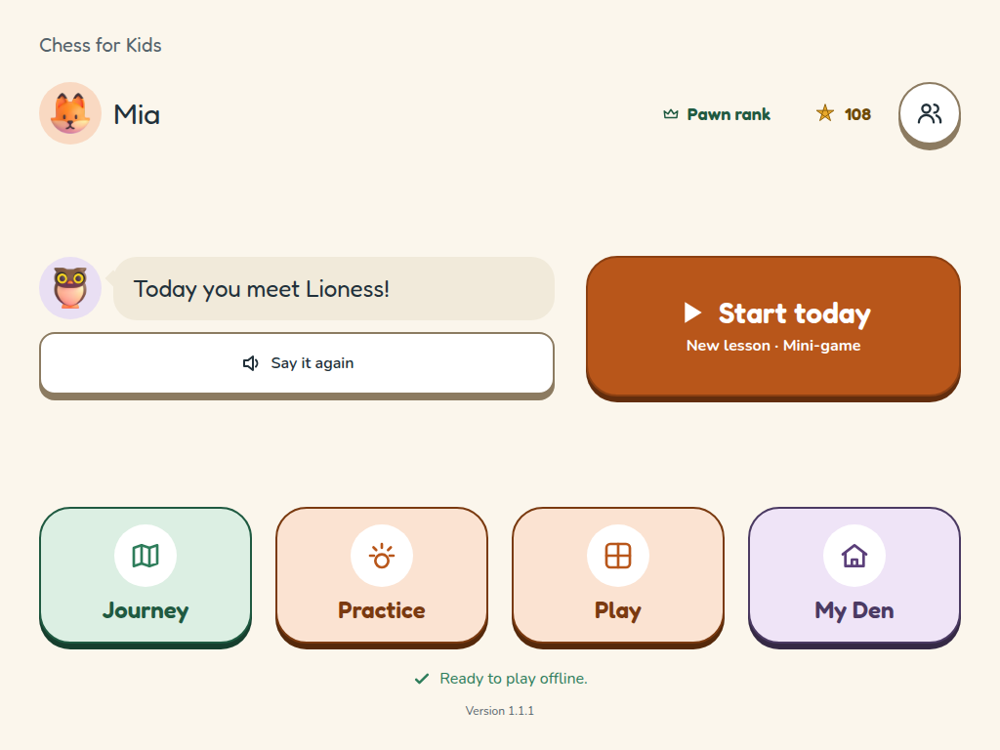
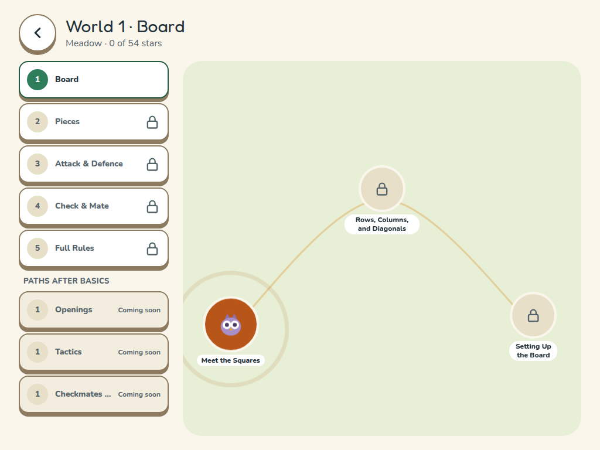
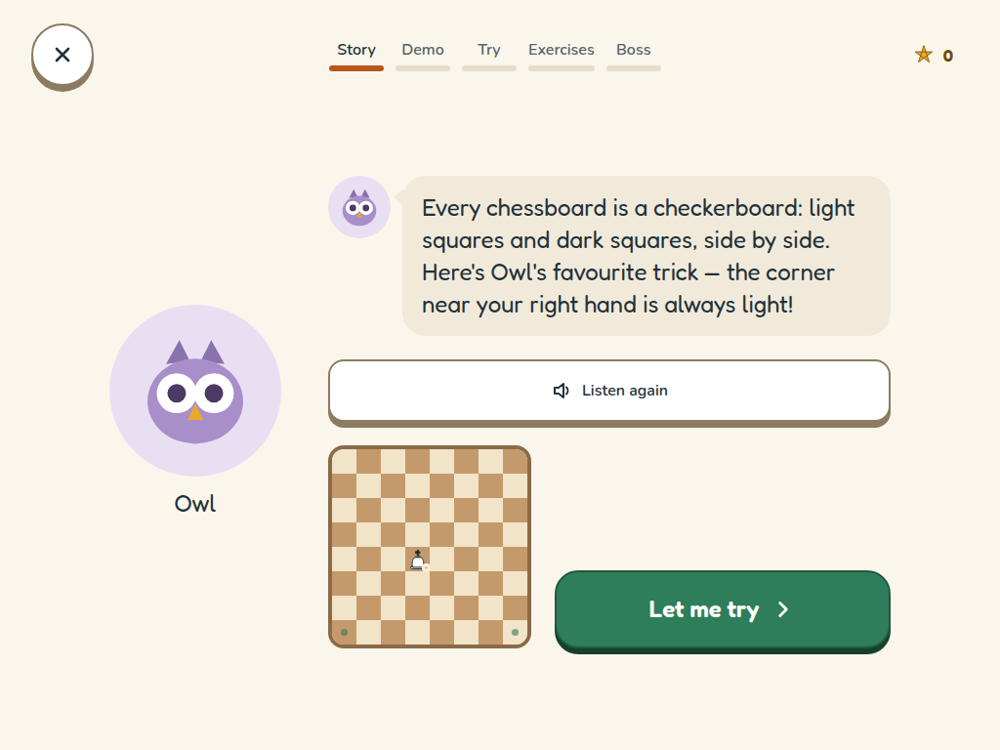
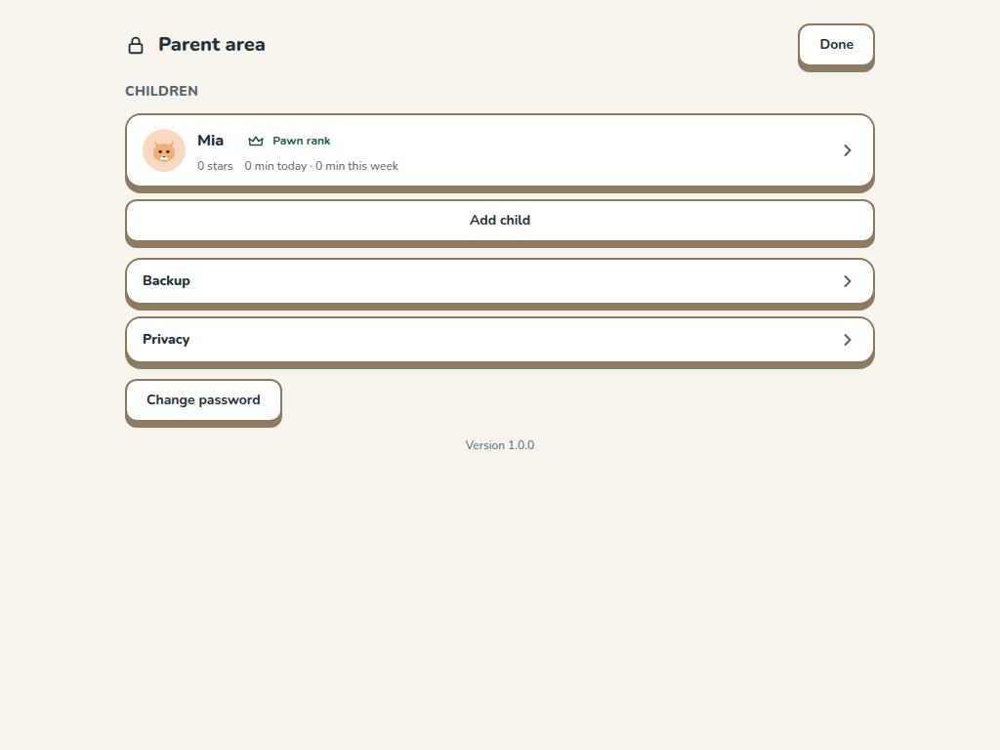

# Chess for Kids

An offline, ad-free chess learning app that teaches an absolute beginner how to play, one small
idea at a time — through animal-themed lessons, mini-games, and a friendly computer opponent.

**Live app:** https://enricoag1982.github.io/learningChess/

## Who it's for

An 8-year-old just starting out, playing solo or side by side with a parent. Every lesson is
spoken aloud (subtitles too), touch targets are big, and there's no reading required to get
started.

## How a lesson works

Each lesson walks through five steps:

1. **Story** — an animal character (Rhino the Rook, Elephant the Bishop, …) introduces the idea.
2. **Demo** — Owl shows the move on the board.
3. **Try** — a couple of guided tries with help on hand.
4. **Exercises** — a rising-difficulty set of tasks (tap squares, capture, choose, set up a
   position, and more), each worth up to 3 stars. Stuck twice on a hard one? An easier version is
   offered.
5. **Boss** — a mini-game that puts the new skill to use.

Progress, stars, and rewards (animal friends, badges, a streak) are saved automatically and never
leave the device.

## The Basics (Worlds 1–5)

| World | Habitat | Teaches |
|---|---|---|
| 1 · Board | Meadow | Squares, rows/columns/diagonals, setting up the board |
| 2 · Pieces | Savannah | How each piece moves and captures, promotion |
| 3 · Attack & Defence | Jungle | What a piece attacks, safe vs. hanging, piece values, trades |
| 4 · Check & Mate | Mountains | Check, escaping check, checkmate, mate in 1, stalemate |
| 5 · Full Rules | River | Castling, en passant, draws — then a full game vs. the computer |

After the Basics, three paths continue: **Openings**, **Tactics**, and **Checkmates & Endgames**.

## Screenshots

| Home | Journey map |
|---|---|
|  |  |

| A lesson | Parent area |
|---|---|
|  |  |

## Run it yourself

```sh
pnpm install
pnpm dev              # http://localhost:5173
pnpm test             # unit + content tests
pnpm build             # production build
pnpm test:e2e         # Playwright, against the production build
```

## Documentation

| Doc | Content |
|---|---|
| [`docs/teaching-process.md`](docs/teaching-process.md) | Pedagogy: principles, learning loop, phases, mini-games |
| [`docs/curriculum.md`](docs/curriculum.md) | Full lesson list and mini-game catalogue |
| [`docs/app-structure.md`](docs/app-structure.md) | Modes, profiles, navigation, progression |
| [`docs/domain-model.md`](docs/domain-model.md) | Entities, exercise types, rules |
| [`docs/architecture.md`](docs/architecture.md) | Stack, layers, repo layout, decisions |
| [`docs/computer-opponent.md`](docs/computer-opponent.md) | Bot levels (Mouse → Bear) |
| [`docs/rewards.md`](docs/rewards.md) | Stars, badges, streak |
| [`docs/non-functional.md`](docs/non-functional.md) | Offline, accessibility, privacy, performance |
| [`docs/screens.md`](docs/screens.md) | UI rules and screen list |
| [`docs/roadmap.md`](docs/roadmap.md) | Milestones, playtests, decisions |
| [`docs/privacy-policy.md`](docs/privacy-policy.md) | Privacy policy (also in-app, parent area → Privacy) |
| [`docs/release.md`](docs/release.md) | Release checklist, tagging, rollback |
| [`CONTRIBUTING.md`](CONTRIBUTING.md) | Workflow, branches, quality gate |

## Licence notes

- Chess rules engine: [chess.js](https://github.com/jhlywa/chess.js) (BSD-2-Clause).
- Fonts: Fredoka and Nunito, via [Fontsource](https://fontsource.org/) (SIL Open Font License).
- No third-party analytics, ads, or tracking of any kind — see
  [`docs/privacy-policy.md`](docs/privacy-policy.md).

## Credits

- Animal art: [Fluent Emoji 3D](https://github.com/microsoft/fluentui-emoji) by Microsoft, via
  [@lobehub/fluent-emoji-3d](https://www.npmjs.com/package/@lobehub/fluent-emoji-3d) (MIT — full
  notice: [`apps/web/public/licenses/fluent-emoji.txt`](apps/web/public/licenses/fluent-emoji.txt)).
- Narration voice: generated offline with [Kokoro](https://huggingface.co/hexgrad/Kokoro-82M)
  (Apache License 2.0) — see [`docs/voice.md`](docs/voice.md).
